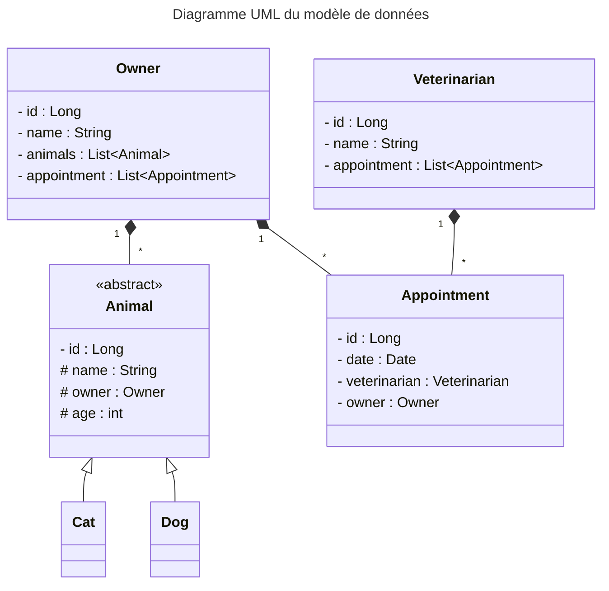

# Template de projet pour le TP JPA 2021 UniR

```mermaid
---
title: Diagramme UML du modèle de données
---
classDiagram
class Animal {
    <<abstract>>
    - id : Long
    # name : String
    # owner : Owner
    # age : int
}   
class Owner {
    - id : Long
    - name : String
    - animals : List~Animal~
    - appointment : List~Appointment~
}
class Veterinarian {
    - id : Long
    - name : String
    - appointment : List~Appointment~
}
class Appointment {
    - id : Long
    - date : Date
    - veterinarian : Veterinarian
    - owner : Owner
}
Animal <|-- Cat
Animal <|-- Dog
Owner "1" *-- "*" Animal
Owner "1" *-- "*" Appointment
Veterinarian "1" *-- "*" Appointment
```

