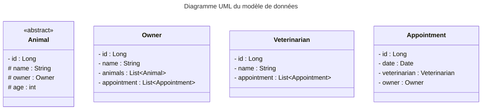

# TP TAA - LELIEVRE Baptiste - Groupe 2

## Organisation du TP

Ce TP est divisé en deux répos git. Il faut rester dans la branche principale dans les deux cas.
Le premier, JaxRS, contient les parties : 
- JPA
- DTO
- mapstruct
- OpenAPI

Le second, Spring Boot, contient les parties :
- Spring Boot
- AOP
- DTO
- mapstruct

La partie "authentification" n'est pas présente car je n'ai pas réussi à la faire fonctionner.

## Pour lancer les différents projets

### JaxRS

Pour lancer le projet, il faut :
- Lancer le serveur hsql run-hsqldb-server.sh (ou run-hsqldb-server.bat) présent à la racine du projet.
- Lancer le JpaTest.java présent dans le package `jpa` pour créer les tables et les remplir.
- Lancer le RestServer présent dans le package `jpa`.

### Spring Boot

Pour lancer le projet, il faut :
- Lancer le serveur hsql run-hsqldb-server.sh (ou run-hsqldb-server.bat) présent à la racine du projet **JPA**.
- Lancer le JpaTest.java présent dans le package `jpa` pour créer les tables et les remplir se trouvant dans le projet **JPA**.
- Lancer le `Taatp3Application.java` présent dans le package `fr.kazhboop.taatp3`.

## Pour tester les différents projets

Au sein des deux projets, les ressources les plus complètes concernent les parties `Animal` et `Owner`.
Voici un exemple de corps de requête pour les différentes requêtes POST et PUT :

```json
{
	"animalType": "CAT",
	"name": "Newt",
	"age" : 6
}
```

### JaxRS

Voici différentes requêtes non exhaustive à effectuer pour tester les différentes fonctionnalités :

`localhost:8080/animals/` : GET  
`localhost:8080/animals/1` : GET  
`localhost:8080/animals/add` : POST  
`localhost:8080/animals/update/1` : PUT  
`localhost:8080/animals/delete/1` : DELETE

### Spring Boot

Voici différentes requêtes non exhaustive à effectuer pour tester les différentes fonctionnalités :

`localhost:8080/animals/` : GET  
`localhost:8080/animals/get-by-name/Newt` : GET  
`localhost:8080/animals/get-by-owner/Baptiste` : GET  
`localhost:8080/animals/update/{animalID}` : PUT  

## Modèle métier

Voici un schéma du modèle métier :



## Difficultés rencontrées

J'ai rencontré des difficultés sur la partie keycloack qui ne fonctionnait pas. J'ai donc décidé de ne pas la faire.  
Par rapport aux nombres de requêtes possible dans les controllers/services, je trouvais cela fastidieux de réaliser chaque requête possible, surtout une seconde fois avec Spring.
